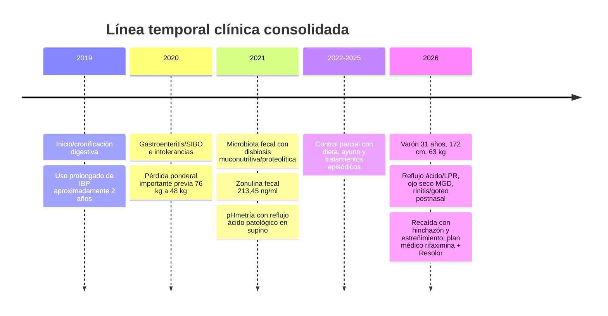
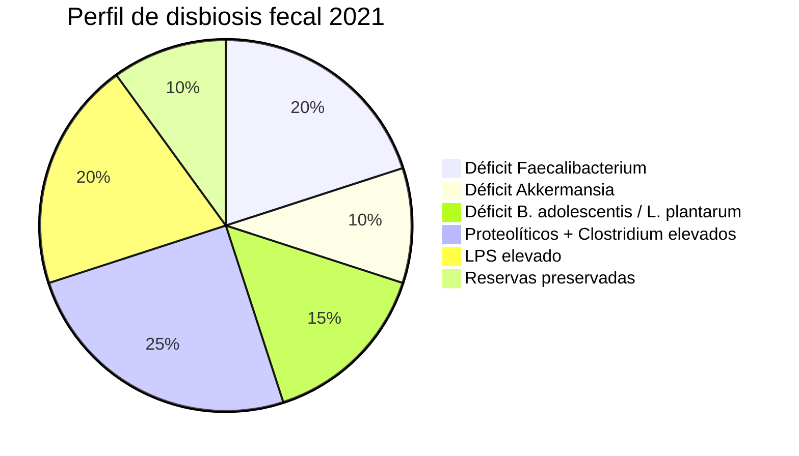
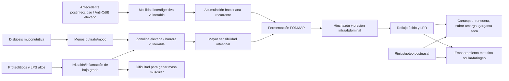
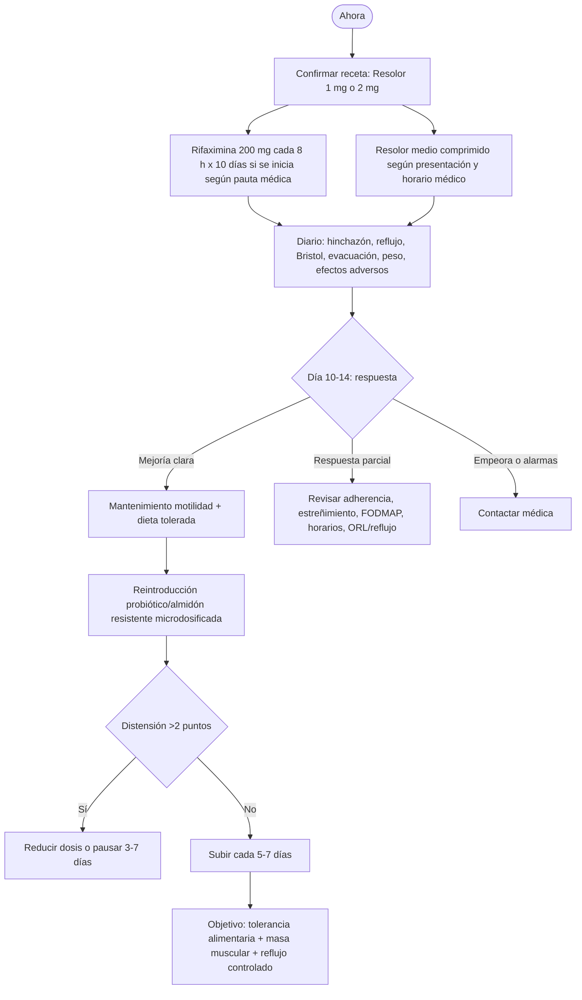
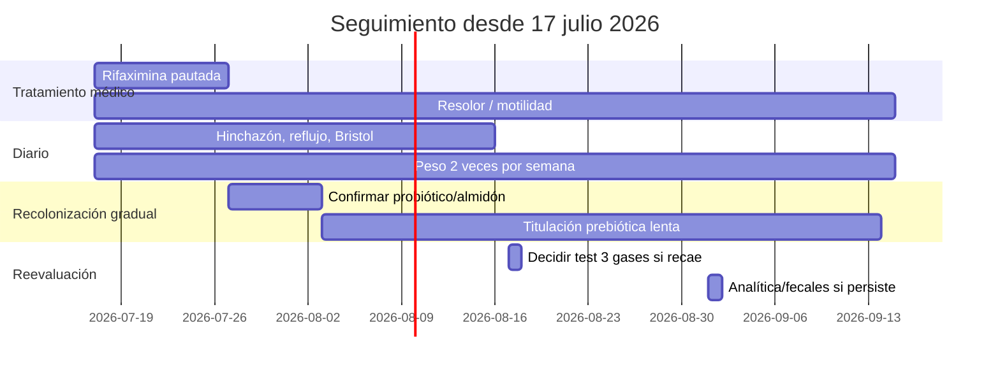

# Análisis integrativo SIBO postinfeccioso — versión operativa 2026

> **Uso previsto:** documento de preparación para consulta médica y seguimiento personal. No sustituye diagnóstico, prescripción ni supervisión por digestivo, inmunología, ORL u oftalmología. Cualquier antibiótico, procinético, vitamina A a dosis altas, ayuno prolongado, péptido experimental o cambio farmacológico debe validarse con el equipo médico.

## A. Resumen ejecutivo del estado actual

### Lectura clínica en una frase

El caso no debe abordarse como “solo microbiota”: el patrón más coherente es un circuito **motilidad interdigestiva alterada + fermentación/FODMAP + presión abdominal + reflujo posicional/LPR + inflamación de mucosas**, con el fenotipo postinfeccioso como factor de recaída y la pHmetría en supino como dato objetivo clave.

### Prioridad real de 2026

La cita del 17 de julio de 2026 reorienta el plan: la doctora no validó NAC, megadosis de vitamina B1 ni ayunos prolongados como eje, sino un enfoque más conservador con **rifaximina puntual para recaída** y **prucaloprida/Resolor como herramienta principal de mantenimiento de motilidad**.

## B. Análisis de microbiota 2021

| Eje | Dato 2021 | Interpretación operativa |
| --- | --- | --- |
| Resiliencia | Índice 57% | Recuperación posible, pero no robusta: requiere progresión lenta, no “golpes” bruscos de prebióticos/probióticos. |
| Barrera/moco | *F. prausnitzii* 8×10⁷ vs ≥1×10⁹; *A. muciniphila* 9×10⁷ vs ≥1×10⁸ | Menor producción de butirato y menor soporte de capa de mucus; priorizar reparación de barrera antes de fermentar agresivamente. |
| Sacarolítica/neuroactiva | *B. adolescentis* 4×10⁷ vs ≥1×10⁸; *L. plantarum* 5×10⁴ vs ≥1×10⁷ | Elegir probióticos y prebióticos con titulación baja, orientados a bifidobacterias/lactobacilos, pero evitando empeorar distensión. |
| Proteólisis/endotoxemia | LPS 5×10⁸ elevado; otros proteolíticos 4×10⁶; *Clostridium* 4×10⁵ | Evitar exceso proteico por comida y largos periodos con bolos gigantes de carne; distribuir proteína para ganar músculo sin alimentar proteólisis colónica. |
| Fermentabilidad | FODMAP tipo 2 | Restricción parcial y dirigida, no dieta baja en FODMAP crónica estricta. |

## C. Mapa de redes metabólicas alteradas

## D. Intervención personalizada por fases

### Fase 0 — estabilización inmediata

1. No entrenar en ayunas si hay ardor, pérdida de peso o dificultad para ganar músculo; usar una comida pequeña 90-120 minutos antes.
2. Mantener 2-3 comidas sin picoteo, pero evitar una única carga enorme de proteína/grasa.
3. Cena más temprana y ligera si el objetivo principal es LPR nocturno; mantener 3-4 horas antes de tumbarse.
4. Elevar cabecera y priorizar decúbito lateral izquierdo si el reflujo supino persiste.
5. Registrar síntomas diariamente antes de introducir nuevas variables.

### Fase 1 — recaída SIBO/SII postinfeccioso

La pauta validada en consulta fue **rifaximina 200 mg cada 8 horas durante 10 días** junto con **medio comprimido de Resolor**, pendiente de confirmar si la caja es de 1 mg o de 2 mg. No añadir NAC, ayuno de 48-72 horas, megadosis de B1 ni protocolos experimentales sin autorización expresa.

### Fase 2 — barrera y butirato sin provocar fermentación

El objetivo no es “meter fibra” de golpe, sino reconstruir tolerancia:

- Empezar almidón resistente/fécula de patata solo cuando la fase antibiótica haya terminado o cuando la doctora lo indique.
- Dosis inicial sugerida para discutir: 1/4 cucharadita, no cucharadas completas.
- Subir cada 5-7 días solo si no aumenta hinchazón, reflujo o estreñimiento.
- Mantener proteína suficiente, pero repartirla en 3 tomas si aparecen heces pastosas, olor fuerte, distensión o reflujo tras bolos proteicos.

### Fase 3 — motilidad como prevención de recaída

La recaída se vuelve más probable si se suspende el soporte procinético, se vuelve al picoteo, se entrena intenso en ayunas con ardor, se acumulan viajes/comidas FODMAP o se abandona el ritmo sueño-luz. El pilar diferencial de 2026 es sostener el “barrido” intestinal con el procinético pautado y ventanas reales sin ingesta.

### Fase 4 — recolonización personalizada

El perfil 2021 favorece una estrategia “bifidogénica y butirogénica gradual”, no un probiótico multicepa agresivo desde el día 1.

1. Primero: estabilidad de motilidad y reducción de hinchazón.
2. Segundo: probiótico con bifidobacterias/lactobacilos, a media dosis o días alternos al inicio.
3. Tercero: almidón resistente microdosificado.
4. Cuarto: FODMAP específicos de bajo riesgo, uno por vez.
5. Quinto: fermentados en dosis de alimento-condimento, no raciones completas.

## E. Respuestas a las 10 preguntas críticas

1. **Capacidad de recuperación:** el 57% de resiliencia y la presencia normal global de *Bifidobacterium*/*Lactobacillus* sugieren capacidad de recuperación parcial, pero los déficits de *F. prausnitzii*, *Akkermansia* y el LPS alto obligan a una progresión lenta.
2. **Elección de probióticos:** priorizar cepas con perfil bifidogénico/lactobacilar y tolerancia clínica; evitar iniciar multicepas a dosis plena durante distensión activa.
3. **Ajustes al protocolo base:** en 2026 manda la consulta: rifaximina puntual + Resolor; NAC y ayunos largos quedan fuera salvo aprobación médica.
4. **Predictores de recaída:** abandono de procinético, estreñimiento, comidas FODMAP en viajes, picoteo, grandes bolos proteicos, sueño irregular y reflujo nocturno no controlado.
5. **Masa muscular sin fermentación:** superávit pequeño, proteína repartida, carbohidratos tolerados bajos en FODMAP alrededor del entrenamiento y evitar entrenar fuerte en ayunas si dispara reflujo.
6. **Biomarcadores prioritarios:** test de aliento 3 gases si cambia la clínica, hemograma, ferritina, B12, folato, vitamina D, zinc, magnesio, TSH/T4L, PCR-us, perfil hepático, calprotectina, elastasa fecal y seguimiento de zonulina si el médico lo considera útil.
7. **Reintroducción FODMAP:** después de 10-14 días de estabilidad, un alimento cada vez, dosis pequeña, 3 días de observación y retirada si sube hinchazón/reflujo más de 2 puntos.
8. **Estrés/SNA:** el sistema autónomo regula acidez, acomodación gástrica y MMC; respiración nasal, sueño regular, luz matinal y evitar sobreentrenamiento son intervenciones de motilidad, no solo de “estrés”.
9. **Escalada si resistencia:** antes de escalar, confirmar gas predominante con test 3 gases, revisar estreñimiento, ORL/reflujo, adherencia y dosis de procinético. Fármacos combinados o terapias experimentales requieren especialista.
10. **Erradicación casi completa:** no significa esterilidad intestinal; significa ausencia funcional de recaídas: hinchazón mínima, reflujo/LPR controlado, 1-2 deposiciones normales/día, tolerancia progresiva a FODMAP, peso/músculo al alza y, si se mide, test de aliento normal o claramente mejorado.

## F. KPI de seguimiento

## G. Semáforo de seguridad

| Color | Acción | Ejemplos |
| --- | --- | --- |
| Verde | Mantener y registrar | Dieta tolerada, comidas espaciadas, cabecera elevada, diario de síntomas. |
| Amarillo | Introducir solo una variable | Probiótico, almidón resistente, FODMAP nuevo, cambios de entrenamiento. |
| Naranja | Consultar antes | Cambiar dosis/horario de Resolor, repetir rifaximina, usar suplementos mucolíticos durante antibiótico. |
| Rojo | No hacer sin supervisión | Ayuno 48-72 h, vitamina A 50.000 UI/día, BPC-157, plasmaféresis, combinaciones antibióticas no prescritas. |

## H. Preguntas concretas para la próxima interacción médica

1. ¿La caja de Resolor es de 1 mg o 2 mg y cuál es la dosis diaria exacta en mg?
2. ¿Debe tomarse por la mañana, noche o separado de comidas?
3. ¿Durante cuántos días seguidos debe mantenerse inicialmente tras la rifaximina?
4. ¿El probiótico se inicia durante rifaximina, justo al terminar o tras unos días de estabilidad?
5. ¿Qué dosis inicial concreta de fécula de patata recomienda para evitar distensión?
6. Si reaparece estreñimiento o reflujo, ¿cuándo repetir test de aliento 3 gases?
7. ¿Conviene pH-impedancia 24 h por LPR actual pese a pHmetría patológica previa en supino?
